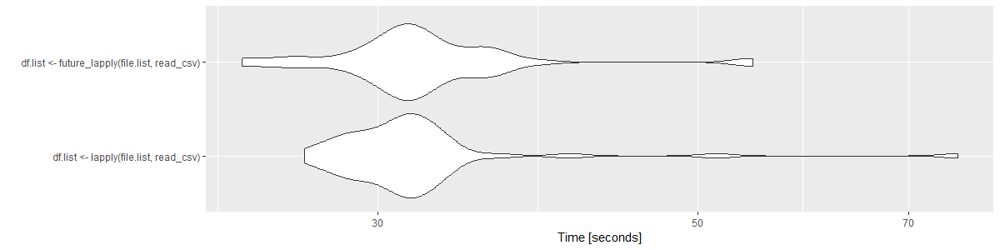

```{r setup, include=FALSE}
knitr::opts_chunk$set(collapse = TRUE)
```

# The Uncertainty of Uncertainty

Conveying uncertainty in data visualisations has become a growing topic in data visualisation circles in the past few years. When considering how to visualise data, one must consider who their audience is and how that audience might interpret a visualisation. In the same way writers adopt different styles of writing to convey information to different audiences, dataviz practioners might choose color, layout, or typography to suit different audiences (e.g. making a color palette color blind friendly or right-aligning a visualization designed for [RTL-writing](https://en.wikipedia.org/wiki/Right-to-left) communities. The options a dataviz practitioner has though are not limited only to the aesthetic design choices. The practitioner's decision to use a certain type of visualisation itself is contingent on the audience's ability to understand it. 

This is especially true when visualising the uncertainty we as researchers know exist. While a statistician or analyst in your company or academic department might understand the error bars on a bar chart you send them, the average person might not. This has prompted discussion about ways we visualise uncertainty.

# How We Historically Visualise Uncertainty

Conventionally, one might express the uncertainty of a mean value by creating a confidence interval of the difference of a mean and standard deviation. We could express that deviation in an error bar, like such:

```{r error, fig.cap="Error bars on Iris data"}
library(ggplot2)
library(dplyr)

iris_sum <- iris %>%
  group_by(Species) %>%
  summarise(mean = mean(Petal.Length),
            sd = sd(Petal.Length))

g <- ggplot(iris_sum, aes(Species, mean, fill = Species)) +
  geom_col() +
  geom_errorbar(aes(ymin = mean - sd, ymax = mean + sd), width = 0.2) +
  labs(y = "Petal length") +
  theme_minimal()
g

```

While this creates clarity that there is *some* uncertainty, it might also convey that probabilistically the likelihood of this value can only fall in this bar and is equally likely to be any point within these bars. One might be able to better express this uncertainty by creating a violin plot of distributions of simualated or real values.

Say we ran a benchmark on two functions to test if one was faster than another. We could run it a few hundred times and create distributions of these two benchmarks and plot them:

```{r vio, fig.cap="Violin plot of benchmarks", warning = FALSE, message = FALSE, eval = FALSE}
mb <- microbenchmark(x, y, n = 50)
ggplot2::autoplot(mb) +
  theme_minimal()

```

